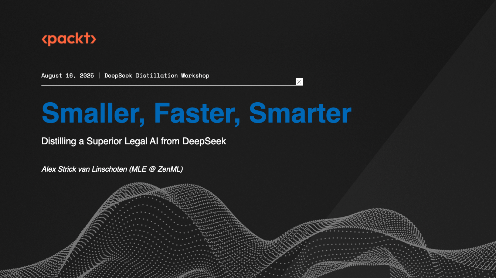

# DeepSeek Distillation Workshop 2025



This repository contains the materials for the DeepSeek Distillation Workshop, held on August 16, 2025. It includes a hands-on notebook for the workshop and a reference implementation of a complete fine-tuning pipeline using ZenML, as featured in the book "DeepSeek Deep Dive".

## Repository Contents

There are two main components in this repository:

1.  **`/workshop`**: This folder contains the standalone Jupyter Notebook (`zenml-deepseek-workshop-august-16-2025.ipynb`) that we will go through during the workshop. It is designed to be run in an environment with GPU access.

2.  **`/zenml_ft_pipelines`**: This folder contains a full-featured set of ZenML fine-tuning pipelines. While we won't cover this code in detail during the workshop, it is provided as a reference for those who want to see a production-ready implementation of the concepts discussed. This code is referenced in the "DeepSeek Deep Dive" book. It has its own `README.md` with further instructions.

---

## Running the Workshop Notebook

The workshop notebook involves LLM fine-tuning and therefore requires a GPU-enabled environment to run efficiently.

### Recommended Environment: Modal.com

We recommend using [Modal.com](https://modal.com/) to run the notebook, as it provides easy access to GPUs and allows you to import the notebook directly from GitHub.

#### How to run on Modal:

1.  **Go to Modal**: Navigate to [modal.com/notebooks](https://modal.com/notebooks).
2.  **Import Notebook**: Click the **"Import notebook"** button and select **"Import from URL"**.
3.  **Paste URL**: Paste the GitHub URL of the notebook file:
    ```
    https://github.com/strickvl/deepseek-distillation-workshop-2025/blob/main/workshop/zenml-deepseek-workshop-august-16-2025.ipynb
    ```
4.  **Select GPU**: When prompted to select hardware, choose a GPU. We recommend an **A100 GPU** for the best performance and speed during the workshop.
5.  **Set Up Secrets**: Before running the notebook cells, you need to configure secrets in your Modal environment.

#### Required Secrets for Modal

You will need to create the following secrets in your Modal account. These are environment variables that the notebook will use to access external services.

-   **OpenRouter API Key**:
    -   **Secret Name**: `DSWORKSHOP_OPENROUTER_API_KEY`
    -   **Value**: Your API key from [OpenRouter](https://openrouter.ai/).
-   **Hugging Face Token**:
    -   **Secret Name**: `HF_TOKEN`
    -   **Value**: Your Hugging Face access token with `write` permissions (for pushing models to the Hub).
-   **OpenRouter API Key (for ZenML pipelines)**:
    -   **Secret Name**: `OPENROUTER_API_KEY`
    -   **Value**: Your API key from [OpenRouter](https://openrouter.ai/). This is used by the `zenml_ft_pipelines` and some tools like `litellm` might pick it up.

---

## The Book: DeepSeek Deep Dive

The concepts and code in this repository are part of the upcoming book, "DeepSeek Deep Dive".


**[Pre-order the book here!](https://tinyurl.com/deepseek-packt-2025)**
